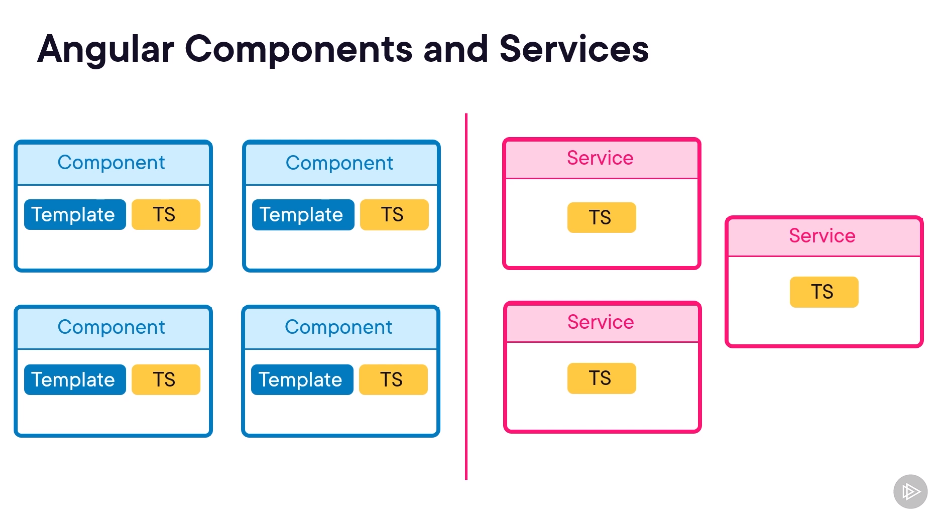

# Angular Fundamentals

Companion website: ???

## Getting Started with Angular

#### Notes
---

##### A Conceptual Overview of Angular

Angular components have separate HTML template files and TypeScript files that hold logic compared to React where HTML and JavaScript co-mingle. Angular services are typically just TypeScript files:

