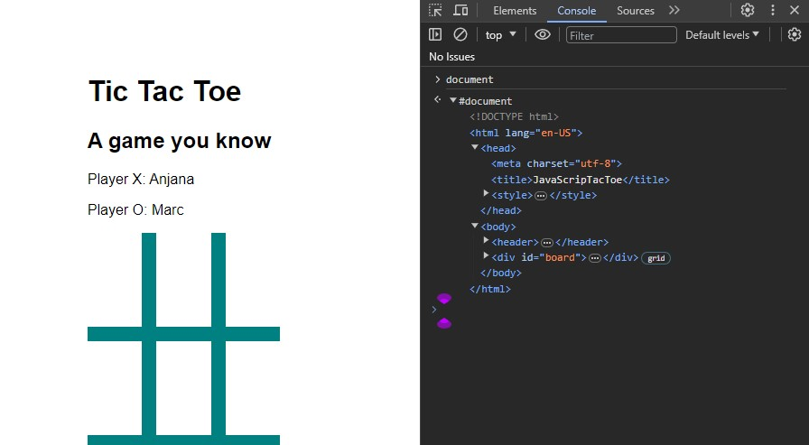
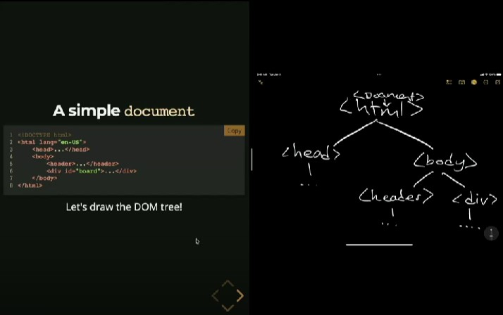

# JavaScript: From First Steps to Professional

Companion website: https://anjana.dev/javascript-first-steps/

Lecture slides: https://anjana.dev/javascript-first-steps/1-slides.html

## Introduction

Start of Introduction slides: https://anjana.dev/javascript-first-steps/1-slides.html#/1

#### Exercises
---

##### Inspect a webpage and experiment in Console

Open https://anjana.dev/javascript-first-steps/1-tictactoe.html in your browser and inspect the page to open DevTools, then click on Console tab. You could log messages inside of the console or add numbers and use JavaScript expressions.

#### Notes
---

##### What is JavaScript?

Check out https://developer.mozilla.org/en-US/docs/Web/JavaScript for a good explanation of what JavaScript is.

##### Why do we need/use JavaScript?

JavaScript adds interactivity and dynamism to a webpage that compliments HTML and CSS.

##### How/Where do we write JavaScript?

We can easily write JavaScript in [Chrome's console](https://developer.chrome.com/docs/devtools/console/), using [VS Code](https://code.visualstudio.com/), or an online sandbox like [CodePen](https://codepen.io/).

#### Miscellaneous
---
##### Just-in-time learning vs. just-in-case learning

Just-in-case learning is the type of learning you received while receiving secondary education (jr. high or high school). It's a wide breadth of knowledge whereas just-in-time learning has more to do with seeking and receiving the necessary knowledge to perform a job or skill. For more info: https://lawsonblake.com/just-in-time-learning/.

##### The Recurse Center

A community that puts on a retreat for programmers similar in nature to a writer's retreat for writers. For more info: https://www.recurse.com/.

## Part 1: DOM, Data Types, Arrays, and Objects

#### Part 1 Project: Tic-Tac-Toe

### The Document Object Model (DOM)
---

Start of The DOM slides: https://anjana.dev/javascript-first-steps/1-slides.html#/4

#### Exercises
---

##### Try playing around with JavaScript's `document` object in Chrome's console

This is in Google Chrome. The `document` model may look different in other browsers.

#### Notes
---

##### What is the DOM?

Check out https://developer.mozilla.org/en-US/docs/Web/API/Document_Object_Model.

##### Anjana draws an example DOM tree

The point of the drawing is to portray how JavaScript "sees" or works with a webpage's HTML structure. It's essentially an object that has respective properties JavaScript can interact with.

#### Miscellaneous
---

## Part 2: Functions, Events, Branches, and Loops

#### Part 2 Project: Quiz Game

## Part 3: Async, Promises, Bugs, and Errors

#### Part 3 Project: Doggos
